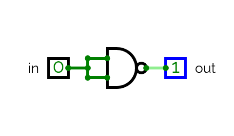
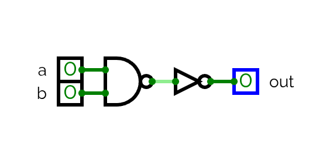
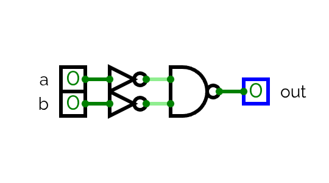
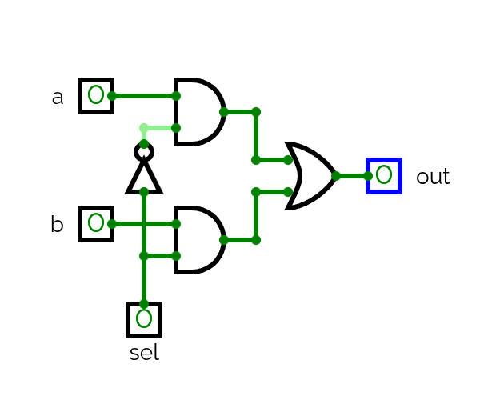
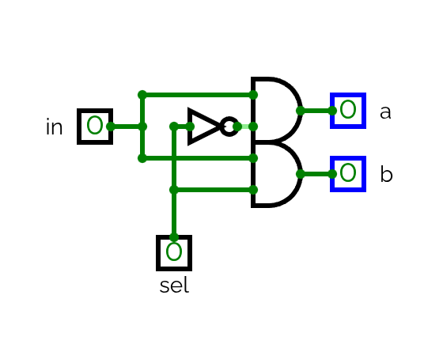

---
tags:
---

# Project 01

In this project we have to build the HDL files of the following logic gates using as a base the elemntary NAND gate.

Once we build a gate we can use it in the following designs.


*Elementary logic gates*
- Not
- And
- Or
- Xor
- Mux
- DMux

*16-bit variants*
- Not16
- And16
- Or16
- Mux16

*Multi-way variants*
- Or8Way
- Mux4Way16
- Mux8Way16
- DMux4Way
- DMux8Way


## Elementary logic gates

### NOT

#### Truth Table

| **in** | **out** |
| ------ | ------- |
| 0      | 1       |
| 1      | 0       |

#### Diagram



#### HDL

[Download](resources/hdl/Not.hdl)

```hdl
/**
 * Not gate:
 * if (in) out = 0, else out = 1
 */
CHIP Not {
    IN in;
    OUT out;

    PARTS:
    Nand(a=in, b=in, out=out);
}
```


### AND

#### Truth Table

| **x** | **y** | **AND** |
| ----- | ----- | ------- |
| 0     | 0     | 0       |
| 0     | 1     | 0       |
| 1     | 0     | 0       |
| 1     | 1     | 1       |

#### Diagram



#### HDL

[Download](resources/hdl/And.hdl)

```hdl
/**
 * And gate:
 * if (a and b) out = 1, else out = 0 
 */
CHIP And {
    IN a, b;
    OUT out;
    
    PARTS:
    Nand(a=a, b=b, out=nandout);
    Not(in=nandout, out=out);
}
```


### Or

#### Truth Table

| **x** | **y** | **OR** |
| ----- | ----- | ------ |
| 0     | 0     | 0      |
| 0     | 1     | 1      |
| 1     | 0     | 1      |
| 1     | 1     | 1      |

#### Diagram



#### HDL

[Download](resources/hdl/Or.hdl)

```hdl
/**
 * Or gate:
 * if (a or b) out = 1, else out = 0 
 */
CHIP Or {
    IN a, b;
    OUT out;

    PARTS:
    Not(in=a, out=nota);
    Not(in=b, out=notb);
    Nand(a=nota, b=notb, out=out);
}
```

### XOR

#### Truth Table

| **x** | **y** | **XOR** |
| ----- | ----- | ------- |
| 0     | 0     | 0       |
| 0     | 1     | 1       |
| 1     | 0     | 1       |
| 1     | 1     | 0       |

#### Diagram


#### HDL

[Download](resources/hdl/Xor.hdl)

```hdl
/**
 * Exclusive-or gate:
 * if ((a and Not(b)) or (Not(a) and b)) out = 1, else out = 0
 */
CHIP Xor {
    IN a, b;
    OUT out;

    PARTS:
    Or(a=a, b=b, out=outor);
    Nand(a=a, b=b, out=outnand);
    And(a=outor, b=outnand, out=out);
}
```

### MUX

#### Truth Table

| **sel** | **out** |
| ------- | ------- |
| 0       | a       |
| 1       | b       |

#### Diagram



#### HDL

[Download](resources/hdl/Mux.hdl)

```hdl
/** 
 * Multiplexor:
 * if (sel = 0) out = a, else out = b
 */
CHIP Mux {
    IN a, b, sel;
    OUT out;

    PARTS:
    Not(in=sel, out=notsel);
    And(a=a, b=notsel, out=outa);
    And(a=b, b=sel, out=outb);
    Or(a=outa, b=outb, out=out);
}
```

### DMUX

#### Truth Table

| **in** | **sel** | **a** | **b** |
| ------ | ------- | ----- | ----- |
| 0      | 0       | 0     | 0     |
| 0      | 1       | 0     | 0     |
| 1      | 0       | 1     | 0     |
| 1      | 1       | 0     | 1     |

#### Diagram



#### HDL

[Download](resources/hdl/DMux.hdl)

```hdl
/**
 * Demultiplexor:
 * [a, b] = [in, 0] if sel = 0
 *          [0, in] if sel = 1
 */
CHIP DMux {
    IN in, sel;
    OUT a, b;

    PARTS:
    Not(in=sel, out=notsel);
    And(a=in, b=notsel, out=a);
    And(a=in, b=sel, out=b);
}
```

## 16 bit Variants


For the 16bit variants we will use the original and compare each bit. Only the HDL will be showed.


### NOT16

[Download](resources/hdl/Not16.hdl)

```hdl
/**
 * 16-bit Not gate:
 * for i = 0, ..., 15:
 * out[i] = Not(a[i])
 */
CHIP Not16 {
    IN in[16];
    OUT out[16];

    PARTS:
    Not(in=in[0], out=out[0]);
    Not(in=in[1], out=out[1]);
    Not(in=in[2], out=out[2]);
    Not(in=in[3], out=out[3]);
    Not(in=in[4], out=out[4]);
    Not(in=in[5], out=out[5]);
    Not(in=in[6], out=out[6]);
    Not(in=in[7], out=out[7]);
    Not(in=in[8], out=out[8]);
    Not(in=in[9], out=out[9]);
    Not(in=in[10], out=out[10]);
    Not(in=in[11], out=out[11]);
    Not(in=in[12], out=out[12]);
    Not(in=in[13], out=out[13]);
    Not(in=in[14], out=out[14]);
    Not(in=in[15], out=out[15]);
}
```

### AND16

[Download](resources/hdl/And16.hdl)

```hdl
/**
 * 16-bit And gate:
 * for i = 0, ..., 15:
 * out[i] = a[i] And b[i] 
 */
CHIP And16 {
    IN a[16], b[16];
    OUT out[16];

    PARTS:
    And(a=a[0], b=b[0], out=out[0]);
    And(a=a[1], b=b[1], out=out[1]);
    And(a=a[2], b=b[2], out=out[2]);
    And(a=a[3], b=b[3], out=out[3]);
    And(a=a[4], b=b[4], out=out[4]);
    And(a=a[5], b=b[5], out=out[5]);
    And(a=a[6], b=b[6], out=out[6]);
    And(a=a[7], b=b[7], out=out[7]);
    And(a=a[8], b=b[8], out=out[8]);
    And(a=a[9], b=b[9], out=out[9]);
    And(a=a[10], b=b[10], out=out[10]);
    And(a=a[11], b=b[11], out=out[11]);
    And(a=a[12], b=b[12], out=out[12]);
    And(a=a[13], b=b[13], out=out[13]);
    And(a=a[14], b=b[14], out=out[14]);
    And(a=a[15], b=b[15], out=out[15]);
}
```

### OR16

[Download](resources/hdl/Or16.hdl)

```hdl
/**
 * 16-bit Or gate:
 * for i = 0, ..., 15:
 * out[i] = a[i] Or b[i] 
 */
CHIP Or16 {
    IN a[16], b[16];
    OUT out[16];

    PARTS:
    Or(a=a[0], b=b[0], out=out[0]);
    Or(a=a[1], b=b[1], out=out[1]);
    Or(a=a[2], b=b[2], out=out[2]);
    Or(a=a[3], b=b[3], out=out[3]);
    Or(a=a[4], b=b[4], out=out[4]);
    Or(a=a[5], b=b[5], out=out[5]);
    Or(a=a[6], b=b[6], out=out[6]);
    Or(a=a[7], b=b[7], out=out[7]);
    Or(a=a[8], b=b[8], out=out[8]);
    Or(a=a[9], b=b[9], out=out[9]);
    Or(a=a[10], b=b[10], out=out[10]);
    Or(a=a[11], b=b[11], out=out[11]);
    Or(a=a[12], b=b[12], out=out[12]);
    Or(a=a[13], b=b[13], out=out[13]);
    Or(a=a[14], b=b[14], out=out[14]);
    Or(a=a[15], b=b[15], out=out[15]);
}
```

### MUX16

[Download](resources/hdl/Mux16.hdl)

```hdl
/**
 * 16-bit multiplexor: 
 * for i = 0, ..., 15:
 * if (sel = 0) out[i] = a[i], else out[i] = b[i]
 */
CHIP Mux16 {
    IN a[16], b[16], sel;
    OUT out[16];

    PARTS:
    Mux(a=a[0], b=b[0], sel=sel, out=out[0]);
    Mux(a=a[1], b=b[1], sel=sel, out=out[1]);
    Mux(a=a[2], b=b[2], sel=sel, out=out[2]);
    Mux(a=a[3], b=b[3], sel=sel, out=out[3]);
    Mux(a=a[4], b=b[4], sel=sel, out=out[4]);
    Mux(a=a[5], b=b[5], sel=sel, out=out[5]);
    Mux(a=a[6], b=b[6], sel=sel, out=out[6]);
    Mux(a=a[7], b=b[7], sel=sel, out=out[7]);
    Mux(a=a[8], b=b[8], sel=sel, out=out[8]);
    Mux(a=a[9], b=b[9], sel=sel, out=out[9]);
    Mux(a=a[10], b=b[10], sel=sel, out=out[10]);
    Mux(a=a[11], b=b[11], sel=sel, out=out[11]);
    Mux(a=a[12], b=b[12], sel=sel, out=out[12]);
    Mux(a=a[13], b=b[13], sel=sel, out=out[13]);
    Mux(a=a[14], b=b[14], sel=sel, out=out[14]);
    Mux(a=a[15], b=b[15], sel=sel, out=out[15]);
}
```


## Multi-way Variants

For this variants we will follow (approximately) the same approach as with the previous ones, as we now have more complex and big circuits we will only show the HDL file.

### Or8Way

[Download](resources/hdl/Or8Way.hdl)

```hdl
/**
 * 8-way Or gate: 
 * out = in[0] Or in[1] Or ... Or in[7]
 */
CHIP Or8Way {
    IN in[8];
    OUT out;

    PARTS:
    Or(a=in[0], b=in[1], out=out0);
    Or(a=in[2], b=in[3], out=out1);
    Or(a=in[4], b=in[5], out=out2);
    Or(a=in[6], b=in[7], out=out3);
    Or(a=out0, b=out1, out=out4);
    Or(a=out2, b=out3, out=out5);
    Or(a=out4, b=out5, out=out);
}
```

### Mux4Way16

[Download](resources/hdl/Mux4Way16.hdl)

```hdl
/**
 * 4-way 16-bit multiplexor:
 * out = a if sel = 00
 *       b if sel = 01
 *       c if sel = 10
 *       d if sel = 11
 */
CHIP Mux4Way16 {
    IN a[16], b[16], c[16], d[16], sel[2];
    OUT out[16];
    
    PARTS:
    Mux16(a=a, b=b, sel=sel[0], out=out1); 
    Mux16(a=c, b=d, sel=sel[0], out=out2); 
    Mux16(a=out1, b=out2, sel=sel[1], out=out); 
}
```

### Mux8Way16

[Download](resources/hdl/Mux8Way16.hdl)

```hdl
/**
 * 8-way 16-bit multiplexor:
 * out = a if sel = 000
 *       b if sel = 001
 *       c if sel = 010
 *       d if sel = 011
 *       e if sel = 100
 *       f if sel = 101
 *       g if sel = 110
 *       h if sel = 111
 */
CHIP Mux8Way16 {
    IN a[16], b[16], c[16], d[16],
       e[16], f[16], g[16], h[16],
       sel[3];
    OUT out[16];

    PARTS:
    Mux4Way16(a=a, b=b, c=c, d=d, sel=sel[0..1], out=out1);
    Mux4Way16(a=e, b=f, c=g, d=h, sel=sel[0..1], out=out2);
    Mux16(a=out1, b=out2, sel=sel[2], out=out);
}
```


### DMux4Way

[Download](resources/hdl/DMux4Way.hdl)

```hdl
/**
 * 4-way demultiplexor:
 * [a, b, c, d] = [in, 0, 0, 0] if sel = 00
 *                [0, in, 0, 0] if sel = 01
 *                [0, 0, in, 0] if sel = 10
 *                [0, 0, 0, in] if sel = 11
 */
CHIP DMux4Way {
    IN in, sel[2];
    OUT a, b, c, d;

    PARTS:
    DMux(in=in, sel=sel[1], a=top, b=bottom);
    DMux(in=top, sel=sel[0], a=a, b=b);
    DMux(in=bottom, sel=sel[0], a=c, b=d);
}
```

### DMux8Way

[Download](resources/hdl/DMux8Way.hdl)

```hdl
/**
 * 8-way demultiplexor:
 * [a, b, c, d, e, f, g, h] = [in, 0,  0,  0,  0,  0,  0,  0] if sel = 000
 *                            [0, in,  0,  0,  0,  0,  0,  0] if sel = 001
 *                            [0,  0, in,  0,  0,  0,  0,  0] if sel = 010
 *                            [0,  0,  0, in,  0,  0,  0,  0] if sel = 011
 *                            [0,  0,  0,  0, in,  0,  0,  0] if sel = 100
 *                            [0,  0,  0,  0,  0, in,  0,  0] if sel = 101
 *                            [0,  0,  0,  0,  0,  0, in,  0] if sel = 110
 *                            [0,  0,  0,  0,  0,  0,  0, in] if sel = 111
 */
CHIP DMux8Way {
    IN in, sel[3];
    OUT a, b, c, d, e, f, g, h;

    PARTS:
    DMux4Way(in=in, sel=sel[1..2], a=top, b=middletop, c=middlebottom, d=bottom);
    DMux(in=top, sel=sel[0], a=a, b=b);
    DMux(in=middletop, sel=sel[0], a=c, b=d);
    DMux(in=middlebottom, sel=sel[0], a=e, b=f);
    DMux(in=bottom, sel=sel[0], a=g, b=h);
}
```