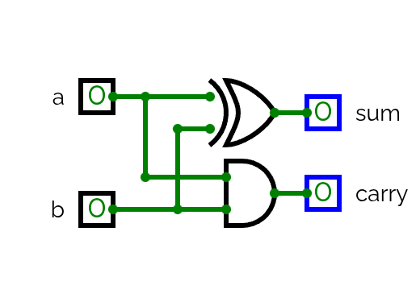

---
tags:
---

# Boolean Arithmetic

## Binary Number

A binary number is represented with only two symbols, being them `0` and `1`, each symbol is called a bit.
But right now we can only represent two numbers, 0 and 1, if we want to represent bigger numbers we can just increase the number of bits used, for example, if we use 4 bits, we will be able to represent 16 numbers, being the formula to calculate it **2^n -1**. To show an example, the decimal number 14 in binary is `1110`, as we can see we are using 4 bits.

In general we will use a fixed number of bits, say 8 bits, the max number that we can represent is 255, but usually we want to reserve part of this numbers to represent negative ones, so our most-left bit will actually tell if the number it's a negative number, narrowing down our possibilities to only the half.

## Binary to Decimal

To convert a binary number to it's decimal equivalent we will sum the value of all the positions which have a 1, for example, to convert the number `1010` to decimal, we need to go from right to left, and see which position we are looking, then get it's value with **2^n** and, if it's a 1, add it to the total, so, from right to left, starting with the position 0.

| **Bit** | **Position** | **Value** | **Real Value** |
| ------- | ------------ | --------- | -------------- |
| 0       | 0            | 1         | 0              |
| 1       | 1            | 2         | 2              |
| 0       | 2            | 4         | 0              |
| 1       | 3            | 8         | 8              |
Now we sum up the **Real Value** column and we get the decimal number 10.

## Binary Addition

Addition with binary numbers is the same as with decimal numbers, check each column 1 by 1 and overflow/carry if needed. If we are adding two 1 a Carry Out will be generated and carried onto the next column.

We will need to create components to do the addition, we will use 3 components:
- Half Adder -> Adds two bits.
- Full Adder -> Adds three bits.
- Add16 -> Adds two numbers.

### Half Adder

The truth table for the half adder is the following:

| **a** | **b** | **sum** | **carry** |
| ----- | ----- | ------- | --------- |
| 0     | 0     | 0       | 0         |
| 0     | 1     | 1       | 0         |
| 1     | 0     | 1       | 0         |
| 1     | 1     | 0       | 1         |

We can easily tell that we need to XOR the inputs onto the **sum** output and AND them into the **carry** output.

The diagram is as follows.

And we create a simple HDL file for this component:

## Full Adder

This full adder is very similar to the HalfAdder, the key difference is that we add a carry input (named `c`) and calculate based on it. It has the following truth table:

| **a** | **b** | **c** | **sum** | **carry** |
| ----- | ----- | ----- | ------- | --------- |
| 0     | 0     | 0     | 0       | 0         |
| 0     | 0     | 1     | 1       | 0         |
| 0     | 1     | 0     | 1       | 0         |
| 0     | 1     | 1     | 0       | 1         |
| 1     | 0     | 0     | 1       | 0         |
| 1     | 0     | 1     | 0       | 1         |
| 1     | 1     | 0     | 0       | 1         |
| 1     | 1     | 1     | 1       | 1         |

We use the following diagram:

And the shown HDL.

### Add16

To build an Add16 we just have to concatenate 16 FullAdder together, only the HDL will be shown:

