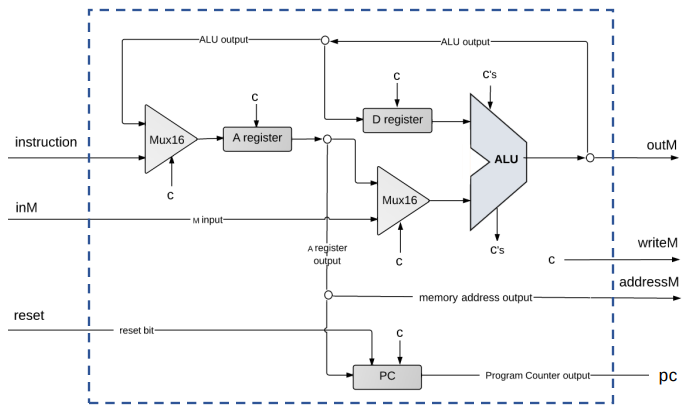

---
tags:
---

# Computer Architecture

## Fetch-Execute Cycle

The basic CPU loop consists in Fetching an instruction and then Executing it.

Fetching can be achieved with the following steps.
- Put the location of the next instruction into the *address* of the program memory.
- Get the instruction code itself by reading the memory contents at that location.

The address of the next instruction will be stored in the `Program Counter` (PC). PC will normally output `old_value+1`, but in some cases we will need to jump to a certain location of the program, this can be achieved by loading another value into the program counter.

Executing the instruction means looking at the bits of the program memory and decide what to do with them.
- Which arithmetic or logical instruction.
- What memory to access.
- If/Where to jump.
- ...

In our case, the Hack Machine language contains the `C-Instructions` which contains subsets of bits that allow us to control different aspects of the operation.

## CPU

For our CPU we will have 3 inputs and 4 outputs.

| **Name**    | **In/Out** | **Word Size** | **Description**                                          |
| ----------- | ---------- | ------------- | -------------------------------------------------------- |
| inM         | input      | 16            | Data received from the memory.                           |
| instruction | input      | 16            | Data received from the instruction memory.               |
| reset       | input      | 1             | Resets the computer, setting PC=0.                       |
| outM        | output     | 16            | Output sent to the memory.                               |
| writeM      | output     | 1             | If set to 1 the memory will write the value received.    |
| addressM    | output     | 15            | Selected address of the memory.                          |
| pc          | output     | 15            | Contains the address of the next instruction to execute. |

A general schema for the Hack CPU is the following.

All the `c` inputs of the different chips are the control bits, which will be defined by either a direct wiring from the instruction or a *decision-based* control bit.

## Memory

Our memory will be divided into 3 main segments. On the other hand, we will have a `ROM32K` built-in chip that will represent the `Instruction Memory`, but this part will be *outside* of the Memory chip.

The main parts of our memory will be.
1. Data Memory
2. Screen
3. Keyboard

Our **Data Memory** extends from address `0` up to the address `16383`, giving us plenty of space for the data of our applications.

The **screen** will go from the address `16384` to `24575`, each bit of every address corresponds to a different pixel of the screen.

Finally we have the **keyboard**, this is simply a register, located at `24576`, this register will contain the Key-Code of the key currently pressed in the keyboard.

In conclusion, we have the following addresses inside of our memory.

| **Purpose** | **Start** | **End** | **StartBinary (16-bit)** | **EndBinary (16-bit)** |
| ----------- | --------- | ------- | ------------------------ | ---------------------- |
| Data Memory | 0         | 16383   | 0000000000000000         | 0011111111111111       |
| Screen      | 16384     | 24575   | 0100000000000000         | 0101111111111111       |
| Keyboard    | 24576     | -       | 0110000000000000         | -                      |

> Screen and Keyboard have it's own built-in chips.

## Computer

The computer itself will connect all the main chips together. A general implementation diagram is the following.

