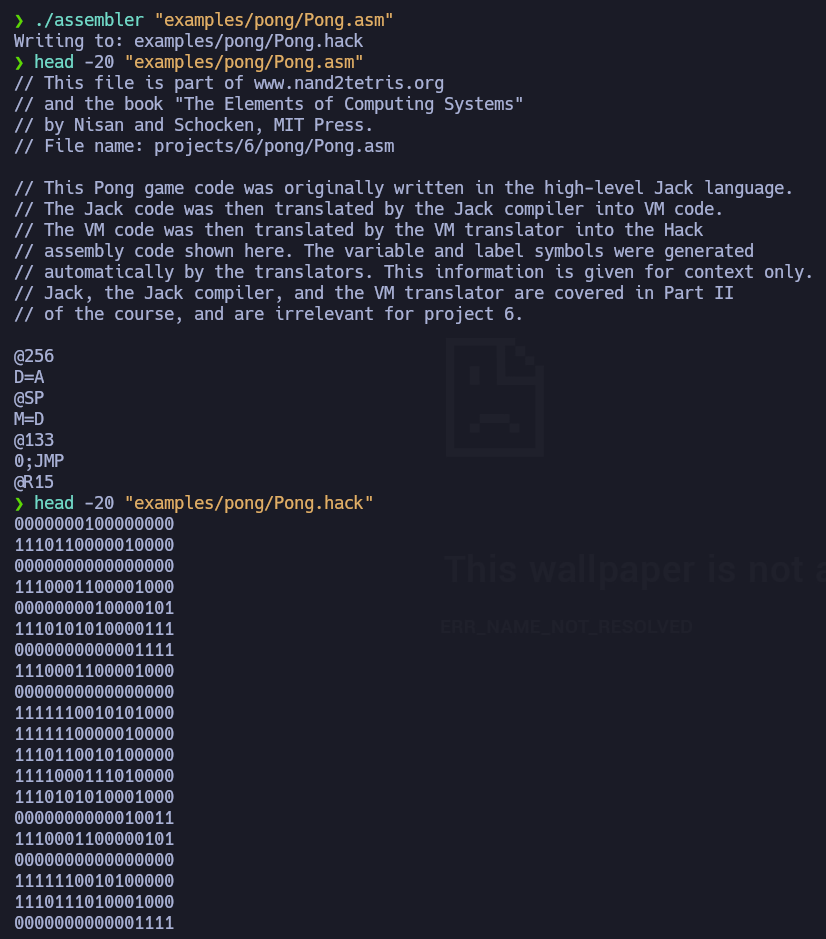

---
tags:
---

# Project 06

Every program inside the `examples` folder was provided by the NAND2Tetris course.

`assembler` is the main file of this program. It loads all of the Symbol Tables. And parse the file provided. In two steps. The first one will loop through the input file, parsing each instruction to get it's type and field. When finding a label it will add it to the `dynamic_table` variable, which contains all the symbols for the dynamic values, like labels and variables. On the second loop it will convert all of the instructions, stored in a `tProgram` variable and save them into an output file.

`SymbolTable` contains the definition and functions for the `tSymbolTable` data type. This type loads data from a file using the `symbolTable_load` function. The file to load from has to be in a `key=value` format, having each key in a new line.

`InstructionAPI` contains the definition and functions for the `tInstruction` data type. This type is the elemental type that will contain all the necessary data for each line.

`ProgramAPI` contains the definition and functions for the `tProgram` data type. This type is the responsible of holding all the instructions in memory while, for example, searching for labels.

`Parser` contains functions to parse a line, removing it's comments and/or white-spaces and retrieving only the instruction. It then extracts each field and type of the instruction.

`Code` contains the functions to get the binary value of a certain instruction.

Our program will have 4 Symbol Tables, being the first one for symbols and the other 3 to convert instruction into their binary.
- `dynamic` -> Pre-defined Symbols, User-set LABELS and variables.
- `dest` -> Decimal value of the `dest` binary table.
- `comp` -> Decimal value of the `comp` binary table.
- `jump` -> Decimal value of the `jump` binary table.

To execute the program we just need to run it's binary using a parameter, this will be the `asm` file to convert.

