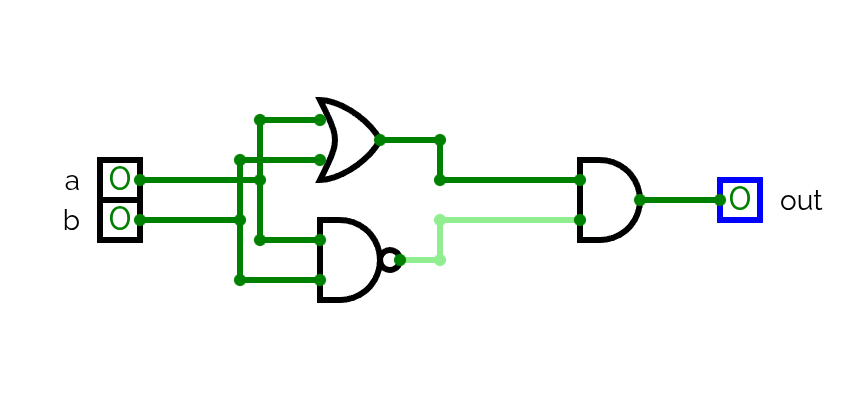

---
tags:
---

# Hardware Description Language

Hardware Description Language (HDL) is the language used to define, test and build logic gates.

To create a component we first need to have the exact requirements for it, for example, to build an XOR gate, which output is 1 only if one of the two inputs is 1, we need to have it's truth table:

| **x** | **y** | **out** |
| ----- | ----- | ------- |
| 0     | 0     | 0       |
| 0     | 1     | 1       |
| 1     | 0     | 1       |
| 1     | 1     | 0       |

We then create the HDL file with an structure like the following:

> This is also called the Gate Interface

```hdl
/** Xor gate: out (a And Not(b)) Or (Not(a) And b)) */

CHIP Xor {
	IN a,b
	OUT out;
	
	PARTS:
	// Implementation here
}
```


To actually know which parts do we need we will create a diagram based on the truth table representation. For each connection we need a name:



Then we can actually create the full HDL file based on this diagram.
We need to create an entry for each chip that we will use, and define it's properties.

```hdl
/** Xor gate: out (a And Not(b)) Or (Not(a) And b)) */

CHIP Xor {
	IN a,b
	OUT out;
	
	PARTS:
	Not (in=a, out=nota);
	Not (in=b, out=notb);
	And (a=a, b=notb, out=aAndNotb);
	And (a=nota, b=b, out=notaAndb);
	Or (a=aAndNotb, b=notaAndb, out=out);
}
```

## Buses in HDL

To describe an array of bits or Bus in HDL we can append `[x]` to the name of the input / output, being `x` the amount of bits inside the bus. For example:

```hdl
/** Adds three 16-bit values */

CHIP Add3Way16 {
	IN first[16],second[16], third[16];
	OUT out[16];
	
	PARTS:
	Add16(a=first, b=second, out=temp);
	Add16(a=temp, b=third, out=out);
}
```

If we want to access to a certain bit of the bus we can do the following:

```hdl
/** ANDs together all 4 bits of the input */

CHIP And4Way {
	IN a[4];
	OUT out;
	
	PARTS:
	And (a=a[0], b=a[1], out=t01);
	And (a=t01, b=a[2], out=t012);
	And (a=t012, b=a[3], out=out);
}
```