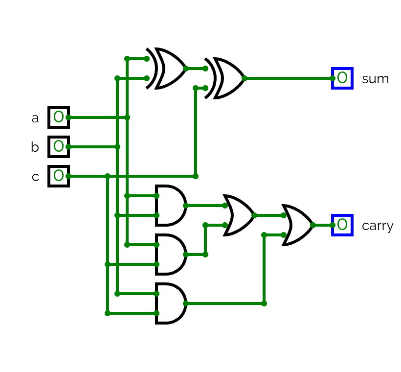

---
tags:
---

# Project 02

In the second project we will have to build the ALU and all of it's core components.

The built components are:
- HalfAdder
- FullAdder
- Add16
- Inc16
- ALU

### Half Adder

#### Truth Table

| **a** | **b** | **sum** | **carry** |
| ----- | ----- | ------- | --------- |
| 0     | 0     | 0       | 0         |
| 0     | 1     | 1       | 0         |
| 1     | 0     | 1       | 0         |
| 1     | 1     | 0       | 1         |

We can easily tell that we need to XOR the inputs onto the **sum** output and AND them into the **carry** output.

#### Diagram


#### HDL

[Download](resources/hdl/HalfAdder.hdl)

```hdl
/**
 * Computes the sum of two bits.
 */
CHIP HalfAdder {
    IN a, b;    // 1-bit inputs
    OUT sum,    // Right bit of a + b 
        carry;  // Left bit of a + b

    PARTS:
    Xor(a=a, b=b, out=sum);
    And(a=a, b=b, out=carry);
}
```


## Full Adder

This full adder is very similar to the HalfAdder, the key difference is that we add a carry input (named `c`) and calculate based on it.

#### Truth Table

| **a** | **b** | **c** | **sum** | **carry** |
| ----- | ----- | ----- | ------- | --------- |
| 0     | 0     | 0     | 0       | 0         |
| 0     | 0     | 1     | 1       | 0         |
| 0     | 1     | 0     | 1       | 0         |
| 0     | 1     | 1     | 0       | 1         |
| 1     | 0     | 0     | 1       | 0         |
| 1     | 0     | 1     | 0       | 1         |
| 1     | 1     | 0     | 0       | 1         |
| 1     | 1     | 1     | 1       | 1         |

#### Diagram



#### HDL

[Download](resources/hdl/FullAdder.hdl)

```hdl
/**
 * Computes the sum of three bits.
 */
CHIP FullAdder {
    IN a, b, c;  // 1-bit inputs5
    OUT sum,     // Right bit of a + b + c
        carry;   // Left bit of a + b + c

    PARTS:
    Xor(a=a, b=b, out=xorab);
    Xor(a=xorab, b=c, out=sum);
    And(a=a, b=b, out=andab);
    And(a=a, b=c, out=andac);
    And(a=b, b=c, out=andbc);
    Or(a=andab, b=andac, out=or1);
    Or(a=andbc, b=or1, out=carry);
}
```


### Add16

To build an Add16 we just have to concatenate 16 FullAdder together, only the HDL will be shown.

[Download](resources/hdl/Add16.hdl)

```hdl
/**
 * 16-bit adder: Adds two 16-bit two's complement values.
 * The most significant carry bit is ignored.
 */
CHIP Add16 {
    IN a[16], b[16];
    OUT out[16];

    PARTS:
    HalfAdder(a=a[0], b=b[0], sum=out[0], carry=carry0);
    FullAdder(a=a[1], b=b[1], c=carry0, sum=out[1], carry=carry1);
    FullAdder(a=a[2], b=b[2], c=carry1, sum=out[2], carry=carry2);
    FullAdder(a=a[3], b=b[3], c=carry2, sum=out[3], carry=carry3);
    FullAdder(a=a[4], b=b[4], c=carry3, sum=out[4], carry=carry4);
    FullAdder(a=a[5], b=b[5], c=carry4, sum=out[5], carry=carry5);
    FullAdder(a=a[6], b=b[6], c=carry5, sum=out[6], carry=carry6);
    FullAdder(a=a[7], b=b[7], c=carry6, sum=out[7], carry=carry7);
    FullAdder(a=a[8], b=b[8], c=carry7, sum=out[8], carry=carry8);
    FullAdder(a=a[9], b=b[9], c=carry8, sum=out[9], carry=carry9);
    FullAdder(a=a[10], b=b[10], c=carry9, sum=out[10], carry=carry10);
    FullAdder(a=a[11], b=b[11], c=carry10, sum=out[11], carry=carry11);
    FullAdder(a=a[12], b=b[12], c=carry11, sum=out[12], carry=carry12);
    FullAdder(a=a[13], b=b[13], c=carry12, sum=out[13], carry=carry13);
    FullAdder(a=a[14], b=b[14], c=carry13, sum=out[14], carry=carry14);
    FullAdder(a=a[15], b=b[15], c=carry14, sum=out[15], carry=carry15);
}
```


### Inc16

To make an increment we need to use the Add16 and set the LSB (Less Significant Bit) to 1.

[Download](resources/hdl/Inc16.hdl)

```hdl
/**
 * 16-bit incrementer:
 * out = in + 1
 */
CHIP Inc16 {
    IN in[16];
    OUT out[16];

    PARTS:
    Add16(a=in, b[0]=true, b[1..15]=false, out=out);
}
```


### ALU

The ALU will pre-process, compute and post-process the output.

As the pre-process operations we have:
- zx -> ZeroX -> Set `x` to zero.
- nx -> NegateX -> Flip all the bits of `x`.
- zy -> ZeroY -> Set `y` to zero.
- ny -> NegateY -> Flip all the bits of `y`.

We have two compute operations:
- f=0 -> Will output the result of a bit-wise AND between `x` and `y`.

Finally as Post-process we can:
- no -> NegateOutput -> Flip all the bits of `out`.

We will also have two output bits which depend directly of the value in `out`.
- zr -> Zero -> 1 if final result is a 0.
- ng -> Negative -> 1 if final result is a negative number.


All the pre-process, computation, post-process and checks will be done in the same order that appear, so if we have `zx=1` and `nx=1` we will first negate `x` and the flip it.

The truth table for the ALU is the following.

| **zx** | **nx** | **zy** | **ny** | **f** | **no** | **out** |
| ------ | ------ | ------ | ------ | ----- | ------ | ------- |
| 1      | 0      | 1      | 0      | 1     | 0      | 0       |
| 1      | 1      | 1      | 1      | 1     | 1      | 1       |
| 1      | 1      | 1      | 0      | 1     | 0      | -1      |
| 0      | 0      | 1      | 1      | 0     | 0      | x       |
| 1      | 1      | 0      | 0      | 0     | 0      | y       |
| 0      | 0      | 1      | 1      | 0     | 1      | !x      |
| 1      | 1      | 0      | 0      | 0     | 1      | !y      |
| 0      | 0      | 1      | 1      | 1     | 1      | -x      |
| 1      | 1      | 0      | 0      | 1     | 1      | -y      |
| 0      | 1      | 1      | 1      | 1     | 1      | x+1     |
| 1      | 1      | 0      | 1      | 1     | 1      | y+1     |
| 0      | 0      | 1      | 1      | 1     | 0      | x-1     |
| 1      | 1      | 0      | 0      | 1     | 0      | y-1     |
| 0      | 0      | 0      | 0      | 1     | 0      | x+y     |
| 0      | 1      | 0      | 0      | 1     | 1      | x-y     |
| 0      | 0      | 0      | 1      | 1     | 1      | y-x     |
| 0      | 0      | 0      | 0      | 0     | 0      | x&y     |
| 0      | 1      | 0      | 1      | 0     | 1      | x\|y    |


[Download](resources/hdl/ALU.hdl)

```hdl
/**
 * ALU (Arithmetic Logic Unit):
 * Computes out = one of the following functions:
 *                0, 1, -1,
 *                x, y, !x, !y, -x, -y,
 *                x + 1, y + 1, x - 1, y - 1,
 *                x + y, x - y, y - x,
 *                x & y, x | y
 * on the 16-bit inputs x, y,
 * according to the input bits zx, nx, zy, ny, f, no.
 * In addition, computes the two output bits:
 * if (out == 0) zr = 1, else zr = 0
 * if (out < 0)  ng = 1, else ng = 0
 */
// Implementation: Manipulates the x and y inputs
// and operates on the resulting values, as follows:
// if (zx == 1) sets x = 0        // 16-bit constant
// if (nx == 1) sets x = !x       // bitwise not
// if (zy == 1) sets y = 0        // 16-bit constant
// if (ny == 1) sets y = !y       // bitwise not
// if (f == 1)  sets out = x + y  // integer 2's complement addition
// if (f == 0)  sets out = x & y  // bitwise and
// if (no == 1) sets out = !out   // bitwise not

CHIP ALU {
    IN  
        x[16], y[16],  // 16-bit inputs        
        zx, // zero the x input?
        nx, // negate the x input?
        zy, // zero the y input?
        ny, // negate the y input?
        f,  // compute (out = x + y) or (out = x & y)?
        no; // negate the out output?
    OUT 
        out[16], // 16-bit output
        zr,      // if (out == 0) equals 1, else 0
        ng;      // if (out < 0)  equals 1, else 0

    PARTS:
    // Preprocess X
    And16(a=x, b=false, out=zerox);
    Mux16(a=x, b=zerox, sel=zx, out=x1);
    Not16(in=x1, out=notx1);
    Mux16(a=x1, b=notx1, sel=nx, out=x2);

    // Preprocess Y
    And16(a=y, b=false, out=zeroy);
    Mux16(a=y, b=zeroy, sel=zy, out=y1);
    Not16(in=y1, out=noty1);
    Mux16(a=y1, b=noty1, sel=ny, out=y2);

    // Compute
    Add16(a=x2, b=y2, out=addres);
    And16(a=x2, b=y2, out=andres);
    Mux16(a=andres, b=addres, sel=f, out=outres);

    // Process Output
    Not16(in=outres, out=notout);
    Mux16(a=outres, b=notout, sel=no, out[0..7]=finoutright, out[8..15]=finoutleft);
    Or16(a[0..7]=finoutright, b[8..15]=finoutleft, out=out);

	// Control Bits
    And16(a[8..15]=finoutleft, b=true, out[15]=ng);
    Or8Way(in=finoutright, out=zr1);
    Or8Way(in=finoutleft, out=zr2);
    Or(a=zr1, b=zr2, out=zeroout);
    Not(in=zeroout, out=zr);
}
```